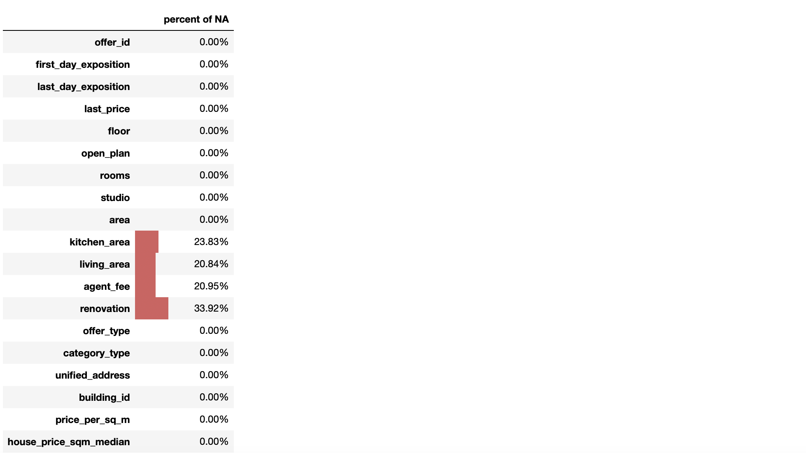
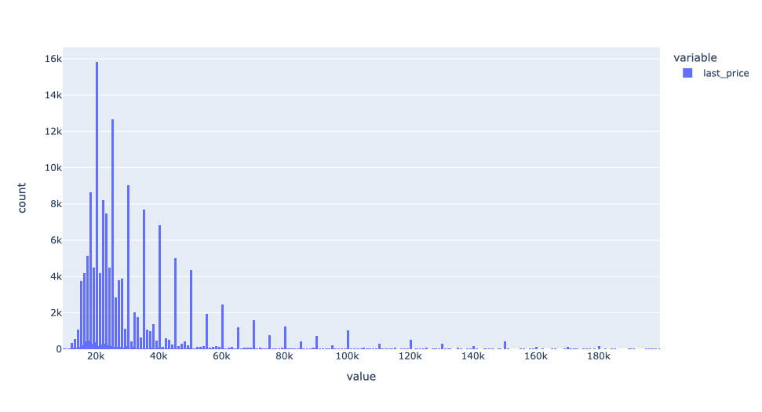
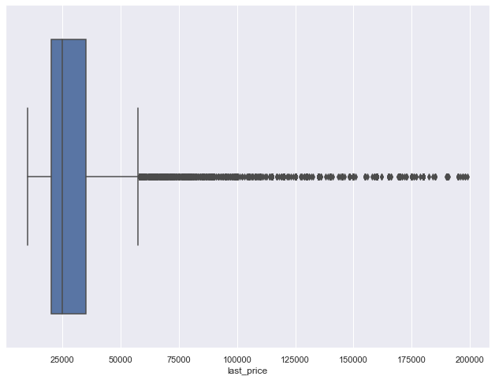
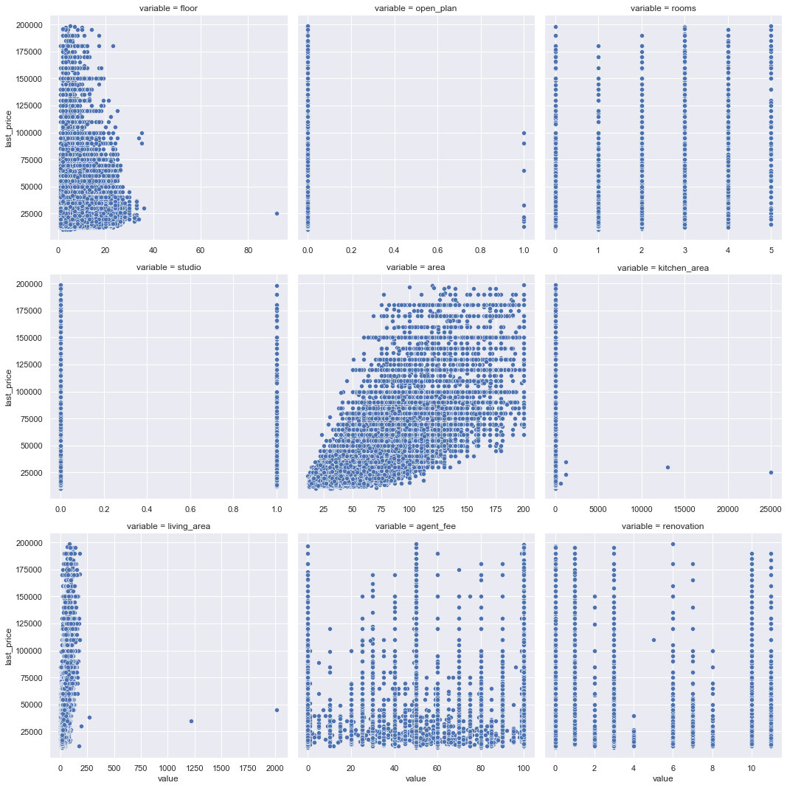
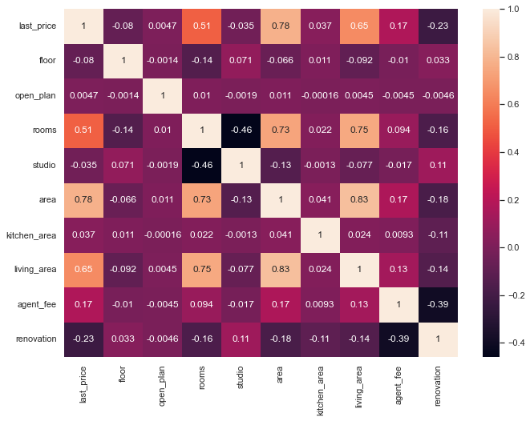
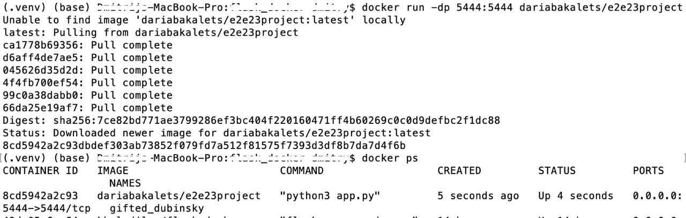
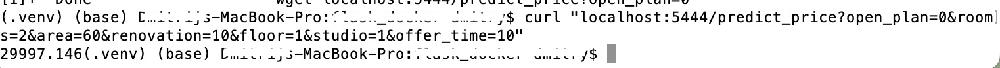

## E2E Sample ML project  

### 1. Information about source data and statistics
**Datasource**: Data is derived from [Yandex.Realty](https://realty.yandex.ru).

**Dataset description**: Real estate listings for apartments in St. Petersburg for rent from 2016 till the middle of August 2018.

Firstly, I cleaned our data by deleting outliers from the original dataset. Our dataset is available in the file named **cleaned_dataset.csv**. The code with exploratory data analysis (EDA) can be found in the file called **lab1_EDA_viz_BakaletsDaria**.

These are the **variables** from the dataset I used in further analysis (including newly generetated variables for data preprocessing purposes like price per squared meter):



We can notice that there are missing values for `living_area`, `kitchen_area`, `agent_fee` and `renovation`. 
What is more, some variables had wrong datatypes: e.g. variable `open_plan` should be transfomed from boolean to integer and `renovation` from float to integer. It has been done further in the analysis.

Then, it is important to dig deeper into the dataset with the help of some visualisation.

#### Histogram of price
Here we can see that `last_price` is right-skewed which resembles a log-normal distribution. 



#### Boxplot of price
I cleaned the dataset from outliers at previous steps, but some of them are still present for the target variable. But the standatization will be applied later, so it is absolutely normal to have some of them left in our sample at the current stage.



#### Scatter plots
Let's construct pairplots to see more dependencies between variables `floor`, `open_plan`, `rooms`, `studio`, `area`, `kitchen_area`, `living_area`, `kitchen_area`, `agent_fee`, `renovation` and our target variable `last_price`. 



#### Heatmap
From the correlation matrix one can observe that not all of the variables have a strong relationship with the`last_price`: for instance, `studio` or `renovation`. However, I will not exclude all of them for the model building purpose.



After some manipulations the data looks like this:

 ```python
    <class 'pandas.core.frame.DataFrame'>
    RangeIndex: 155391 entries, 0 to 155390
    Data columns (total 11 columns):
     #   Column                Non-Null Count   Dtype  
    ---  ------                --------------   -----  
     0   first_day_exposition  155391 non-null  object 
     1   last_day_exposition   155391 non-null  object 
     2   last_price            155391 non-null  float64
     3   floor                 155391 non-null  int64  
     4   open_plan             155391 non-null  int64  
     5   rooms                 155391 non-null  int64  
     6   studio                155391 non-null  int64  
     7   area                  155391 non-null  float64
     8   agent_fee             122840 non-null  float64
     9   renovation            155391 non-null  int64  
    dtypes: float64(3), int64(5), object(2)
    memory usage: 13.0+ MB
```
We can notice that there are still some nulls for `agent_fee`. I excluded this variable in our final model at all due to its poor explanatory power for renting apartments. However, I generated a new variable `offer_time` which shows us the time the offer was listed on the website:

```python
rent_df_cleaned['first_day_exposition'] = pd.to_datetime(rent_df_cleaned.first_day_exposition)
```
```python
rent_df_cleaned['last_day_exposition'] = pd.to_datetime(rent_df_cleaned.last_day_exposition)
```
```python
rent_df_cleaned['offer_time'] = (rent_df_cleaned['last_day_exposition'] - rent_df_cleaned['first_day_exposition']).dt.days
```
After that, I deleted the first two variables that we didn't need anymore.

Now, let's split the dataset into train, test, and holdout samples:

```python
    train_df = rent_df_cleaned[(rent_df_cleaned.first_day_exposition >= '2018-01-01') 
                              & (rent_df_cleaned.first_day_exposition < '2018-04-01')]

    test_df = rent_df_cleaned[(rent_df_cleaned.first_day_exposition >= '2018-04-01') 
                              & (rent_df_cleaned.first_day_exposition < '2018-06-01')]

    holdout_df = rent_df_cleaned[rent_df_cleaned.first_day_exposition >= '2018-06-01']
```

### 2. Information about the model and chosen framework

I have decided to use **XGBRegressor** to build and deploy the final ML model since it showed the best result in comparison with other methods. All these models and corresponding metrics can be found in the file called **lab2_building_model_BakaletsDaria**.


```python
numeric_features = ['area', 'offer_time', 'agent_fee' ] 
nominal_features = ['renovation','open_plan', 'rooms', 'floor', 'studio']
```
I implemented SimpleImputer with a default strategy to fill missing values by the mean value of the corresponding variable. OneHotEncoder is used to convert nominal features into a format that allows ML algorithms to understand and appropriatly absorb them.

```python
mapper = DataFrameMapper([([feature], SimpleImputer()) for feature in numeric_features] +\
                         [([feature], OneHotEncoder(handle_unknown='ignore')) for feature in nominal_features],
                             df_out=True)
```
Methods for data processing and model building can be time-consuming, error-prone and difficult to reproduce. However, I was able to improve these processes immensely by using pipelines like this:

```python
pipeline = Pipeline(steps = [('preprocessing', mapper), 
                             ('scaler', StandardScaler()),
                             ('xgb', xgb.XGBRegressor(objective="reg:linear", random_state=99))])
```
Metrics:

```python
    RMSE train = 6548.027
    MAPE train = 0.162
    Accuracy =  83.8227061344956 %
```
```python
    RMSE test = 11262.311
    MAPE test = 0.204
    Accuracy =  61.49581308774685 %
```
Finally, I implemented my final solution and calculated some metrics on **validation** sample:

```python
    MAE: 0.37168259015263216
    MSE: 0.446780861069617
    RMSE: 0.6684166822197192
```

If needed, the code for the resulting ML model can be found in the file named **ML_model_BakaletsD**. It was downloaded as a **.pkl file**. All .pkl files can be found in "mlmodels" folder.

### 3. How to install instructions and run an app with virtual environment 

After setting up and connecting to our VM, we can create our virtual environment with these commands:
* `sudo apt install python3.8-venv`
* `python3 -m venv env`
* `source env/bin/activate`

Additionally, we should initialize a git repository in your virtual environment using:
* `sudo apt install git` 
* `git init`
* `git add .` 
* `git commit -m 'Your message'`

Next, pull the files from the repository and install the necessary requirements executing `pip install -r requirements.txt`. If pip is not already installed, then we will be prompted to install it. We can also install libraries manually with `pip install`. The required libraries include numpy, Flask, sklearn, pandas, joblib, xgboost and some other.

To allow access to the port used in the application, run `sudo ufw allow 5444` (5444 - the port number). Then, we can start the application by running `python3 app.py`.

For testing the application, we can use [Postman](https://www.postman.com/), an HTTP request tool. Create a new request and specify our public IP address `<public_IP>:5444` and the port with `/predict_price`. 

In the request body, include the following parameters in this order:
* open_plan (0 or 1)
* rooms (a number)
* area (a number)
* renovation (an integer from 0 to 11)
* floor (a number)
* studio (0 or 1)
* offer_time (a number of days)

Make sure to include all the parameters, or the application will return an error.

### 4. Information about Dockerfile

The **Dockerfile** contains: 
```linux
FROM ubuntu:20.04
MAINTAINER Daria Bakalets
RUN apt-get update -y
COPY . /opt/gsom_predictor
WORKDIR /opt/gsom_predictor
RUN apt install -y python3-pip
RUN pip3 install -r requirements.txt
ENTRYPOINT ["python3", "app.py"]
```
My Docker container is based on the `ubuntu` image. What the code does, firstly, is to update all the packages to the latest versions. Then, it copies all the content to the container (excluding the files specified in the `.dockerignore` file). After that, it creates a working directory called `gsom_predictor`. Inside this directory, it sets up a virtual environment for python3 and installs all the required libraries specified in the requirements.txt file. Finally, it starts an application called `app.py`.

### 5. How to open a port in VM

If we would like to open a port in our VM, we should run the following two commands: 

```linux
sudo apt install ufw
sudo ufw allow 5444 
```

### 6. How to run app using docker and which port it uses

My docker is located [here](https://hub.docker.com/repository/docker/dariabakalets/e2e23project/general) at **docker hub**.

First of all, we may need to install docker at our VM for running this application. We just follow the steps from these two guides: 
* install docker engine: https://docs.docker.com/engine/install/ubuntu/
* post-installation steps: https://docs.docker.com/engine/install/linux-postinstall/

Run `docker pull dariabakalets/e2e23project` to pull the container to our machine.
Then, use the command `docker run -dp 5444:5444 dariabakalets/e2e23project` to run the container. 
The same port as in application.

Again, go to [Postman](https://www.postman.com/) and specify our HTTP-request, see 3.

#### P. S.
My application is avaliable by the following request:
`62.84.120.43:5444/predict_price?open_plan=0&rooms=2&area=60&renovation=10&floor=1&studio=1&offer_time=10`

Here an example how my application is run by another user on their personal machine:





We can specify our own parameters.
